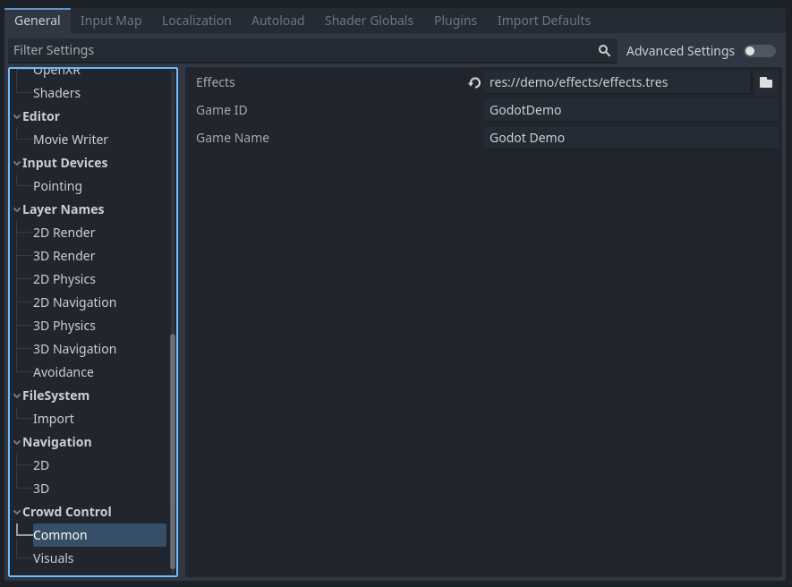
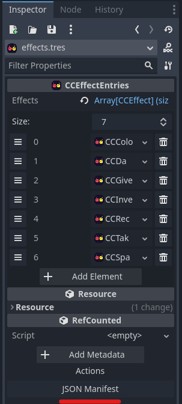

# GodotCrowdControlDemo

A Demo for the GodotCrowdControl GDExtension. Contains a simple game with effects
and a custom overlay.

Notably as to keep the project as clean as possible, the demo uses a static singleton instead
of an autoload and sets project settings on runtime. This is not recommended.

## How to setup your game for Crowd Control

1. Set your game pack name in the project settings (game name is the name that will be displayed in the games list)

2. Create a CCEffectEntries resource and set the effects project setting to the resource path.
3. Create named subclasses of CCEffect to add effects to your game.
4. Once done use the JSON Manifest button to submit your effect pack.

©SilicDev 2023-2024
Sprites kindly provided by [Sigmund_Froid](https://www.twitch.tv/sigmund_froid)
